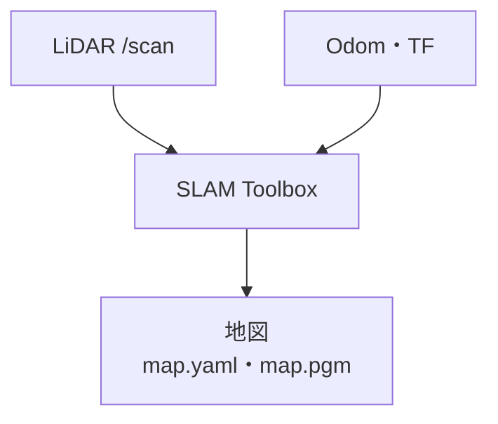
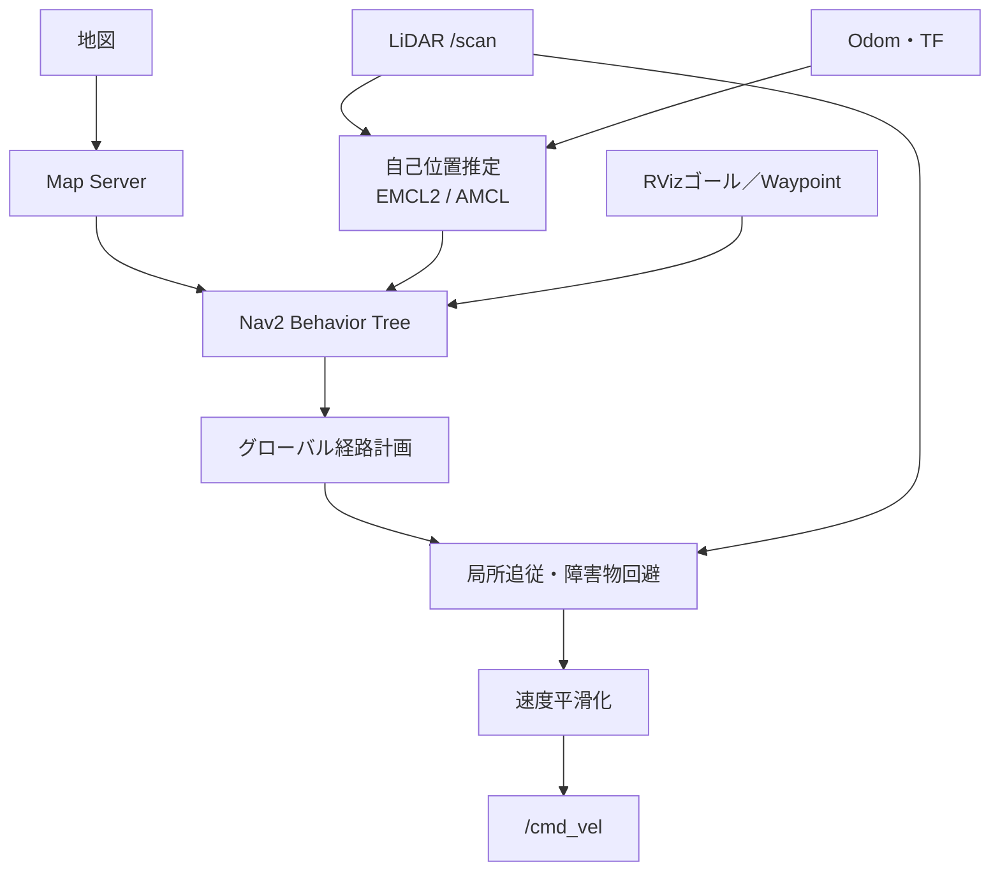

# daifuku_autonomous

Nav2による自律移動

## 必要環境

- Ubuntu/Debian系Linux
- ROS 2のインストール
- `sudo`権限とネットワーク接続

## 環境構築

以下のコマンドで環境を構築

```bash
make setup
```

## ビルド

```bash
make build
```

## 起動

### 1. GazeboでTurtleBot3 Worldを起動

```bash
make sim
```

または

```bash
pkill -f gzserver
pkill -f gzclient
pkill -f gazebo
source /usr/share/gazebo/setup.sh
export TURTLEBOT3_MODEL=burger
export GAZEBO_MODEL_DATABASE_URI=""
ros2 launch turtlebot3_gazebo turtlebot3_world.launch.py
```

### 2. SLAMによる地図作成

#### SLAMを起動

```bash
make slam
```

または

```bash
ros2 launch autonomous_slam mapping.launch.py use_sim_time:=true
```

#### キーボード操作（`/cmd_vel`）

```bash
make teleop
```

または

```bash
ros2 run turtlebot3_teleop teleop_keyboard
```

#### 地図の保存

```bash
ros2 run nav2_map_server map_saver_cli -f $PWD/src/autonomous_slam/maps/map
```

### 3. 保存済み地図によるNav2起動

#### シミュレータ

ターミナル1でGazebo起動

```bash
make sim
```

ターミナル2でNav2起動

```bash
make dev-sim
```

<!-- ```bash
ros2 launch autonomous_nav navigation.launch.py map:=$PWD/src/autonomous_nav/maps/map_turtlebot3
.yaml use_sim_time:=true localization:=emcl2
``` -->

#### 実機
```bash
make dev
```

<!-- ```bash
ros2 launch autonomous_nav navigation.launch.py map:=$PWD/src/autonomous_nav/maps/map_tsudanuma.yaml use_sim_time:=false localization:=emcl2
``` -->


RVizの**2D Pose Estimate**で初期位置を指定→Nav2 Goal Poseでゴールを指定可能

### Waypoint Managerパネル

- Nav2起動後、RViz2の**Panels → Add New Panel**から`nav2_waypoint_manager/WaypointManagerPanel`を追加する
- yaml形式でwaypointの保存と読み込みが可能

### 4. RVizからゴールを送信

RVizからゴールの2D Poseを指定

## Makeコマンド
### 

| コマンド       | 説明                                    |
| -------------- | --------------------------------------- |
| `make help`    | 利用可能なコマンドの表示                |
| `make build`   | ワークスペースの通常ビルド              |
| `make rebuild` | CMakeキャッシュを削除して再構成・ビルド |
| `make deps`    | パッケージ依存関係の導入                |
| `make test`    | テストの実行                            |
| `make clean`   | ビルド生成物の削除                      |

### 引数
`MAP`、`USE_SIM_TIME`、`LOCALIZATION`、`USE_RVIZ`


## 現在の構成

### 地図作成フロー


### ナビゲーションフロー


### 使用アルゴリズム

| 役割               | コンポーネント／アルゴリズム                     | Nav2  | 入出力・補足                                      |
| ------------------ | ------------------------------------------------ | :---: | ------------------------------------------------- |
| 地図作成           | SLAM Toolbox（scan matching、Ceres Solver）      |   ×   | `/scan`とodom/TFからの地図生成                    |
| 自己位置推定       | EMCL2（既定）                                    |   ×   | 地図、`/scan`、odomからの`map → odom`推定         |
| 自己位置推定       | AMCL（選択可）                                   |   ○   | 地図、`/scan`、odomからの`map → odom`推定         |
| 地図配信           | Map Server                                       |   ○   | 保存済み地図のNav2への配信                        |
| グローバル経路計画 | NavFn Planner（A*）                              |   ○   | `use_astar: true`。ゴールまでのグローバル経路計画 |
| 経路平滑化         | Simple Smoother                                  |   ○   | グローバル経路の平滑化                            |
| 局所経路追従       | Regulated Pure Pursuit                           |   ○   | 経路・局所コストマップからの速度指令生成          |
| 障害物回避         | Costmap 2D（Voxel / Obstacle / Inflation Layer） |   ○   | `/scan`による障害物情報の反映                     |
| 速度平滑化         | Velocity Smoother                                |   ○   | `/cmd_vel`の急変抑制                              |
| 行動制御・復帰     | Nav2 Behavior Tree、Spin / BackUp など           |   ○   | 計画・追従・失敗時の復帰制御                      |
| 複数地点の巡回     | Waypoint Manager + NavigateThroughPoses          |   ○   | RViz登録地点列のNav2への送信                      |
