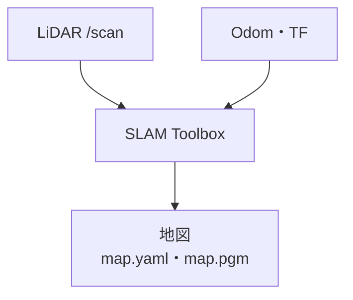
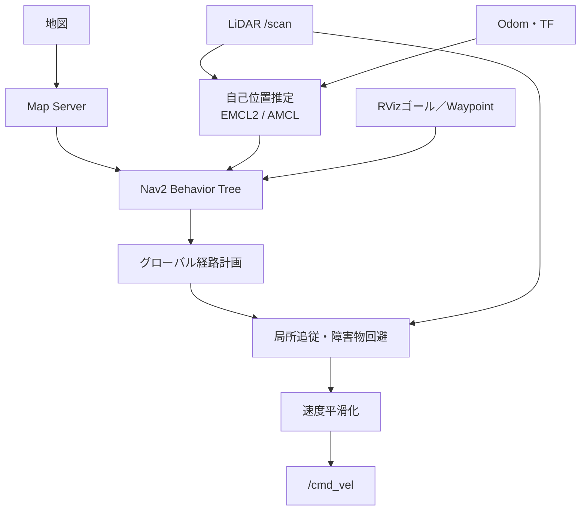

# daifuku_autonomous

Nav2による自律移動

## 必要環境

- ROS 2のインストール
- `turtlebot3_gazebo`、`turtlebot3_teleop`、`nav2_bringup`、`slam_toolbox`のインストール

不足時の依存パッケージインストール

```bash
rosdep install --from-paths src --ignore-src -r -y
```

## EMCL2

ソース取得と依存パッケージのインストール

```bash
vcs import src < autonomous_bot.repo
rosdep install --from-paths src --ignore-src -r -y
```

## ビルド

```bash
colcon build --packages-select autonomous_nav emcl2 nav2_waypoint_manager
source install/setup.sh
```

## 起動

### 1. GazeboでTurtleBot3 Worldを起動

ターミナル1でのGazebo起動

```bash
pkill -f gzserver
pkill -f gzclient
pkill -f gazebo
source /usr/share/gazebo/setup.sh
export TURTLEBOT3_MODEL=burger
ros2 launch turtlebot3_gazebo turtlebot3_world.launch.py
```

TurtleBot3、`/scan`、`/odom`、TF、`/clock`などの起動

### 2. SLAMによる地図作成

#### SLAMを起動

```bash
ros2 launch autonomous_nav mapping.launch.py use_sim_time:=true
```

#### キーボード操作（`/cmd_vel`）
```bash
ros2 run turtlebot3_teleop teleop_keyboard
```

#### 地図の保存

```bash
ros2 run nav2_map_server map_saver_cli -f src/autonomous_nav/maps/map
```

保存後に作成または更新されるファイル

- `src/autonomous_nav/maps/map.yaml`
- `src/autonomous_nav/maps/map.pgm`

### 3. 保存済み地図によるNav2起動

自己位置推定アルゴリズムの切替

- `localization:=emcl2`（デフォルト）
- `localization:=amcl`

#### シミュレータ

```bash
ros2 launch autonomous_nav navigation.launch.py map:=$PWD/src/autonomous_nav/maps/turtlebot3.yaml use_sim_time:=true localization:=emcl2
```

#### 実機

事前作成済み地図のパス指定

```bash
ros2 launch autonomous_nav navigation.launch.py map:=$PWD/src/autonomous_nav/maps/map.yaml use_sim_time:=false localization:=emcl2
```


RVizの**2D Pose Estimate**による地図上のロボット初期姿勢の設定

### Waypoint Managerパネル

Nav2起動後、RViz2の**Panels → Add New Panel**から
`nav2_waypoint_manager/WaypointManagerPanel`を追加。登録したWaypointは
`/waypoint_markers`に表示され、**Start**の選択時に`/navigate_through_poses`アクションへ送信される。
詳細は[`nav2_waypoint_manager/README.md`](src/nav2_waypoint_manager/README.md)を参照

### 4. RVizからゴールを送信

RVizからゴールの2D Poseを指定

## 現在の構成

地図作成用起動ファイル: `mapping.launch.py`

自律走行用起動ファイル: `navigation.launch.py`

### 地図作成




### 使用アルゴリズム

| 役割               | コンポーネント／アルゴリズム                     | Nav2  | 入出力・補足                                       |
| ------------------ | ------------------------------------------------ | :---: | -------------------------------------------------- |
| 地図作成           | SLAM Toolbox（scan matching、Ceres Solver）      |   ×   | `/scan`とodom/TFからの地図生成                     |
| 自己位置推定       | EMCL2（既定）                                    |   ×   | 地図、`/scan`、odomからの`map → odom`推定          |
| 自己位置推定       | AMCL（選択可）                                   |   ○   | 地図、`/scan`、odomからの`map → odom`推定          |
| 地図配信           | Map Server                                       |   ○   | 保存済み地図のNav2への配信                         |
| グローバル経路計画 | NavFn Planner（Dijkstra）                        |   ○   | `use_astar: false`。ゴールまでのグローバル経路計画 |
| 経路平滑化         | Simple Smoother                                  |   ○   | グローバル経路の平滑化                             |
| 局所経路追従       | Regulated Pure Pursuit                           |   ○   | 経路・局所コストマップからの速度指令生成           |
| 障害物回避         | Costmap 2D（Voxel / Obstacle / Inflation Layer） |   ○   | `/scan`による障害物情報の反映                      |
| 速度平滑化         | Velocity Smoother                                |   ○   | `/cmd_vel`の急変抑制                               |
| 行動制御・復帰     | Nav2 Behavior Tree、Spin / BackUp など           |   ○   | 計画・追従・失敗時の復帰制御                       |
| 複数地点の巡回     | Waypoint Manager + NavigateThroughPoses          |   ○   | RViz登録地点列のNav2への送信                       |

設定ファイル: [`src/autonomous_nav/config/`](src/autonomous_nav/config/)

起動ファイル: [`src/autonomous_nav/launch/`](src/autonomous_nav/launch/)
